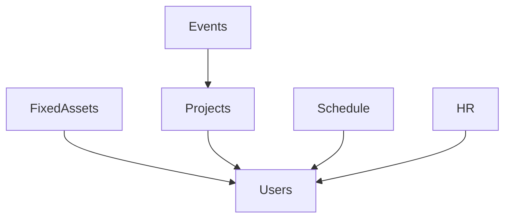

# How to setup in code space
- Open with code space
- Install DDEV
- Currently need to copy the .env file from my own laptop
- Run `ddev config` to setup the project
- Run `ddev start`
- Run `ddev ssh`
- Run `php artisan migrate && composer install && npm run dev` <- inside the SSH
- Run `ddev status` to check the web url

# Testing

