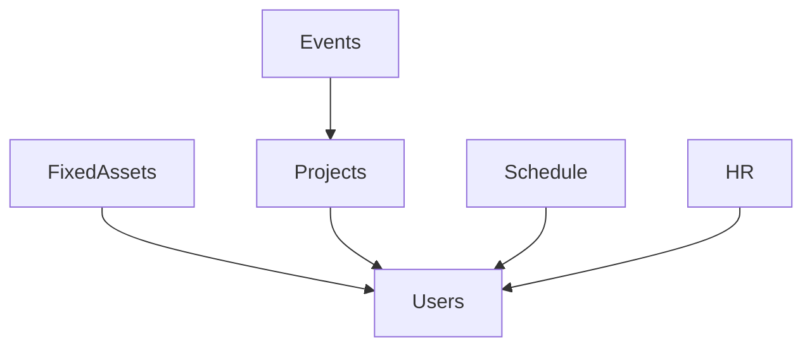

# Setup
## Project Setup
1. Git checkout
2. Add .env
3. Composer install
4. Package install
5. Run `php artisan migrate`
6. Run sedder `php artisan db:seed`

## Git Account
Show current global config `git config --global --list`.

Show current local config `git config --local --list`.

Change user email `git config user.email [emailaddress]`

Change credential user name `git config credential.username [gitusername]`

# How to setup in code space
! the codespace tries to redirect the form post submission to localhost and hence cannot direct to a correct page
- Open with code space
- Install DDEV
- Currently need to copy the .env file from my own laptop
- Run `ddev config` to setup the project
- Run `ddev start`
- Run `ddev ssh`
- Run `php artisan migrate && composer install && npm run dev` <- inside the SSH
- Run `ddev status` to check the web url

# Testing

